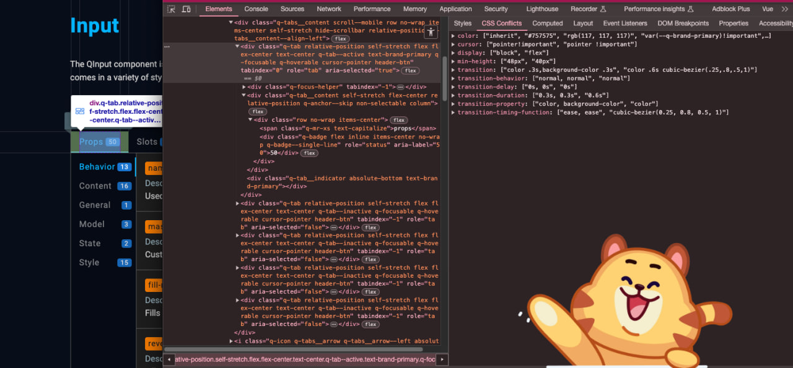
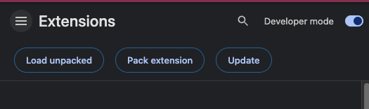

# CSS Conflicts helper

### Novice developers and xD seniors often encounter css conflicts.
- Middle devs can skip this repo :smile:

### Installation
0. Download this repo as zip
1. Open `Manage extensions` on your chrome
2. Turn on developer mode

3. Click `Load unpacked`
4. Select `ext` folder in this repo as extension folder

- Done. If you open inspector you will see a new tab when inspect an element

### 10 Stars - Release on Chrome Web Store (Extensions) for easy installations

### Developer contacts:

 

